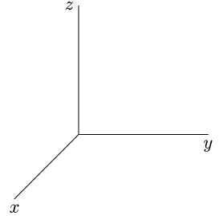
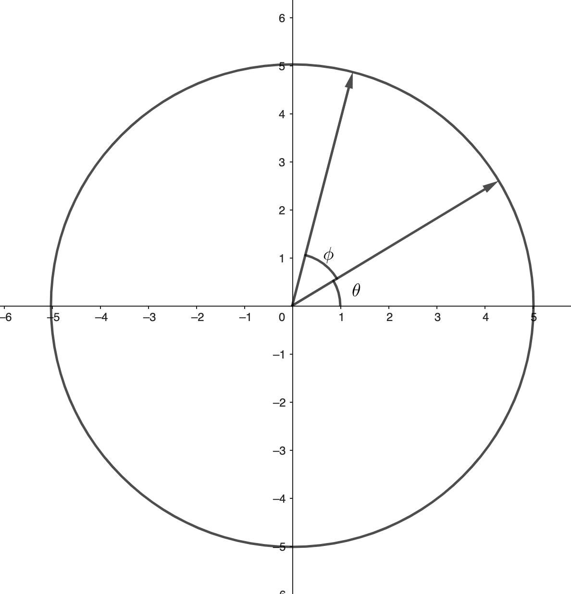
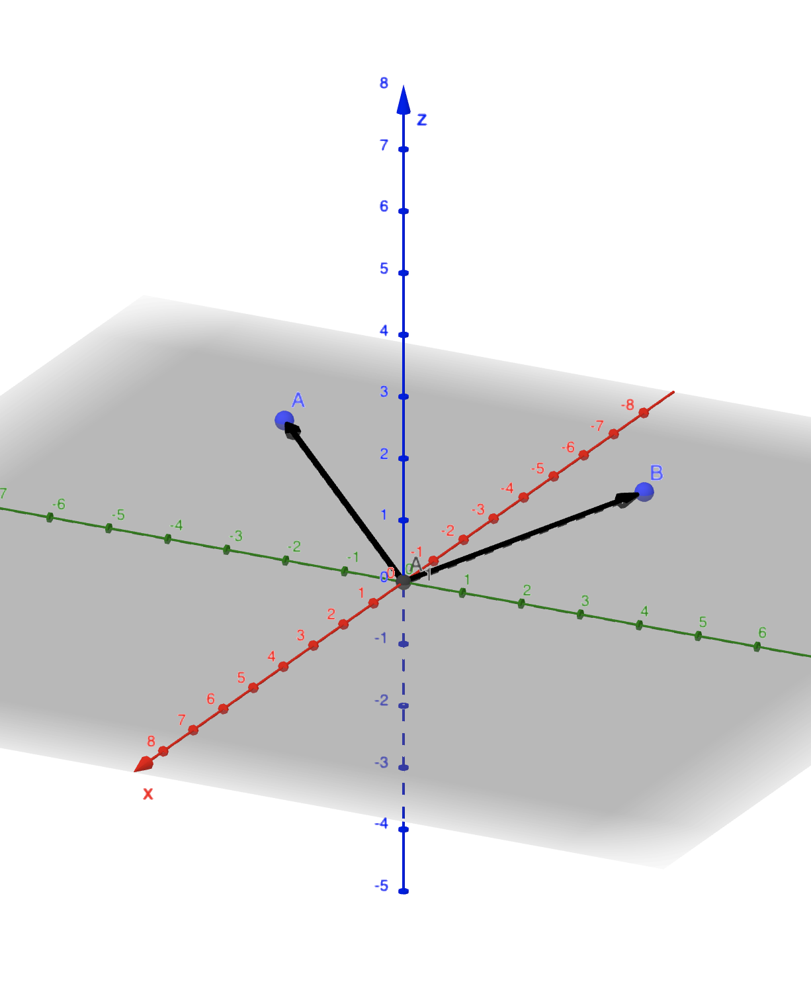
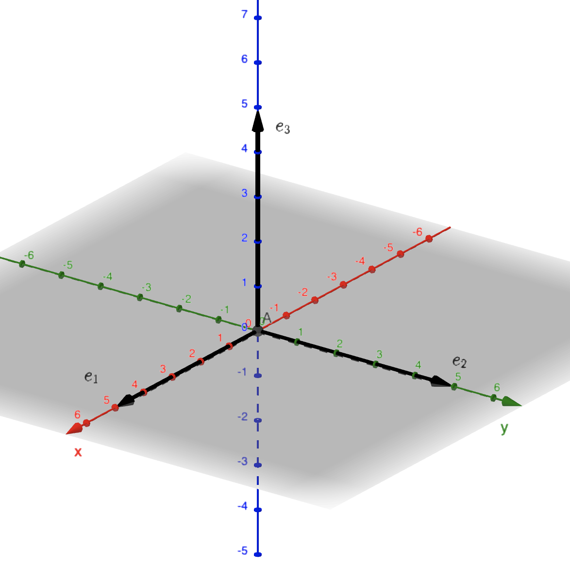

class: title

.content[
# Contact juggling and rotations in 3D

## Joy of ~~Science~~ Math 2023
## Darren Kessner

       
       
 

  

###   
### &nbsp; &nbsp; Ellison Institute   
### &nbsp; &nbsp; of Technology

]

---

layout:true

class: normal

.footer[
Ellison Institute  of Technology
]

---

class: normal

# 3D space

.row[

.column[

 
 
 

]

.column[

  
  
  

$$
\begin{align}
R_z \circ R_y \circ R_x &= I \\\\
\\\\
R_y \circ R_x &= R_z
\end{align}
$$

]

]

---

class: normal

# Composing rotations

.row[
.column[
### 2D

$ R_a \circ R_b = R_c $

 
 

]

.column[

### 3D

$ R_a \circ R_b = \text{rotation?} $

 
 
 

]

]

---

class: normal

# Linear algebra

.row[
.column[

$$
R_x = \begin{bmatrix}
1 & 0 & 0 \\\\
0 & -1 & 0 \\\\
0 & 0 & -1
\end{bmatrix}
$$

 

$$
R_y = \begin{bmatrix}
-1 & 0 & 0 \\\\
0 & 1 & 0 \\\\
0 & 0 & -1
\end{bmatrix}
$$

 

$$
R_z = \begin{bmatrix}
-1 & 0 & 0 \\\\
0 & -1 & 0 \\\\
0 & 0 & 1
\end{bmatrix}
$$

]

.column[

$$
R_x \begin{pmatrix} a \\\\ b \\\\ c \end{pmatrix}
 = \begin{pmatrix} a \\\\ -b \\\\ -c \end{pmatrix}
$$

   
   

$R_x$ flips $y$ and $z$ coordinates.  

$R_y$ flips $x$ and $z$ coordinates.  

$R_z$ flips $x$ and $y$ coordinates.  

]

]

---

class: normal

# Geometric algebra

.row[
.column[

]

.column[

Rotation about $z$-axis is represented by the
_bivector_ $e_1 e_2$.

 

$$
e_1 e_1 = e_2 e_2 = e_3 e_3 = 1
$$

 

$$
(e_1 e_2)(e_2 e_3) = e_1 e_3
$$

 

Quaternions:   

$$
i j = k
$$

]

]

